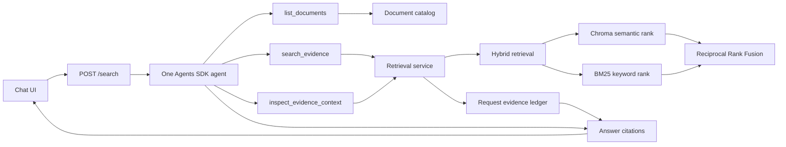

# Agentic Search Architecture

The implementation intentionally uses one agent and a small request-scoped
tool layer. The OpenAI Agents SDK owns the tool-calling loop.

## Request flow

1. The API creates a `ResearchContext` containing the question, history,
   authorized document IDs, and retrieval settings.
2. One agent receives the three document tools.
3. The Agents SDK lets the model call tools repeatedly or return its answer.
4. Each evidence search combines semantic and BM25 rankings with Reciprocal
   Rank Fusion, then returns the requested top results.
5. Successful retrievals are registered in an `EvidenceLedger` as `E1`, `E2`,
   and so on.
6. The agent cites current-request evidence inline, for example `[E1, E2]`.
7. Application code resolves those IDs into the existing public `Citation`
   objects and converts recorded attempts into concise UI steps.

## Responsibility boundary

| Agent decides | Application enforces |
|---|---|
| Search wording | Authorized document scope |
| Whether to reformulate | Request `top_k` |
| Whether context is needed | Stable evidence identity |
| Whether evidence is sufficient | Evidence deduplication |
| Whether to answer, clarify, or report no answer | Maximum SDK turns |

There is no separate planner, validator agent, repair agent, or hard-coded
research sequence.

## Grounding

Tool results contain document passages and stable evidence IDs. The prompt
requires factual answers to cite evidence retrieved during the current request.
Historical citation markers are removed before a follow-up run because ledger
IDs are request-scoped.

This proves citation provenance, not semantic entailment. Model judgment still
determines whether a passage supports a statement; that limitation is documented
and tested behaviorally.
