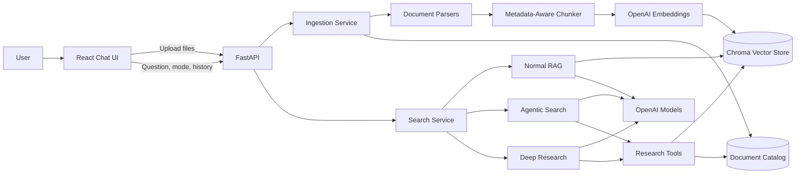
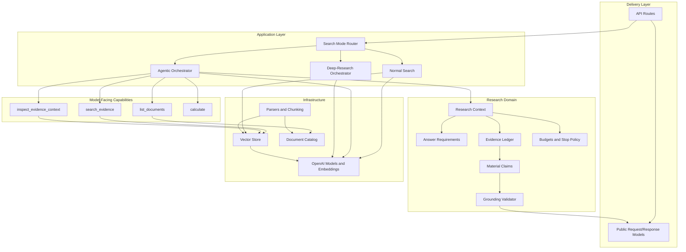
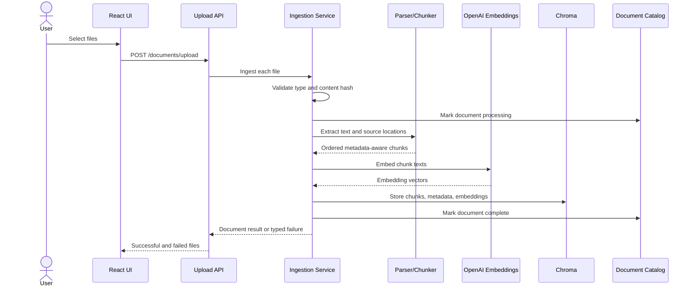
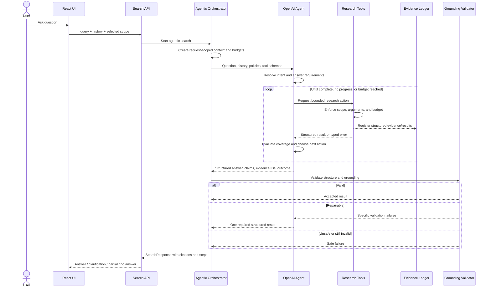
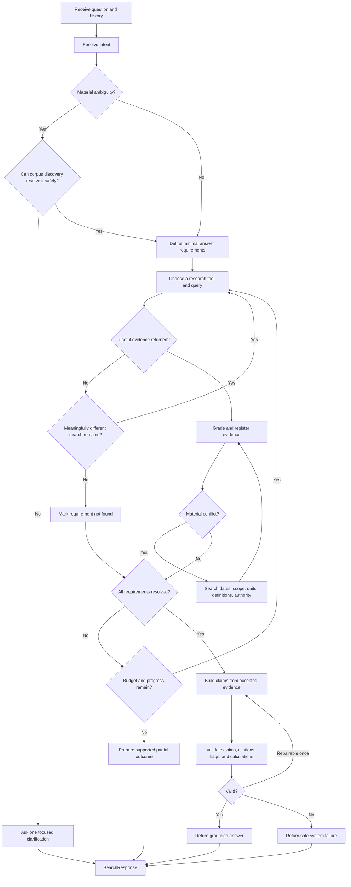
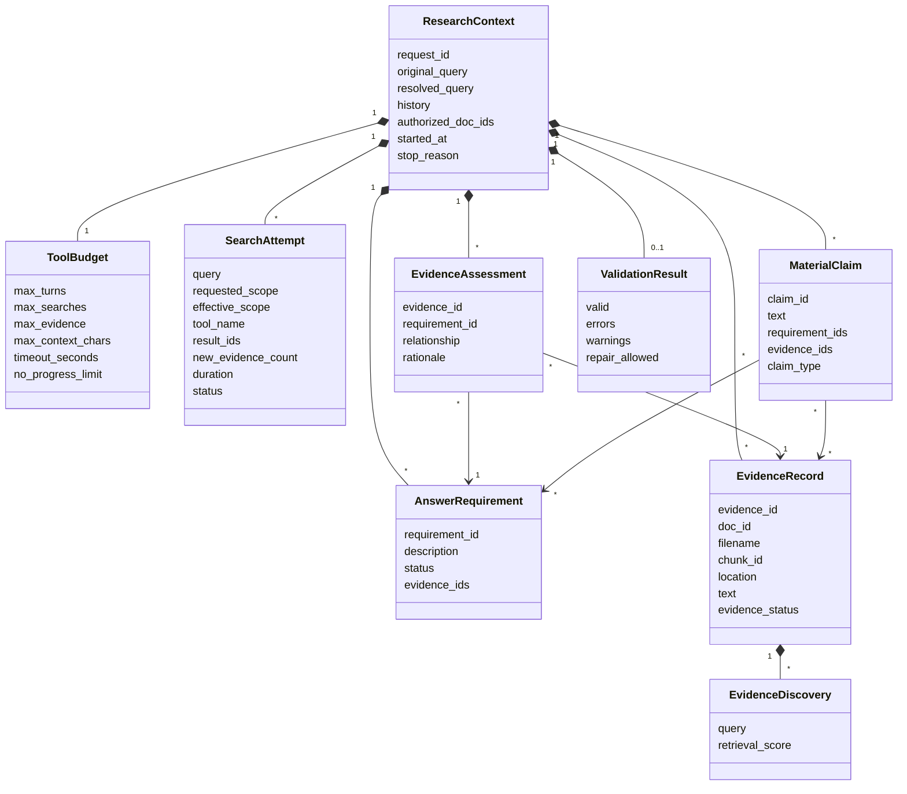
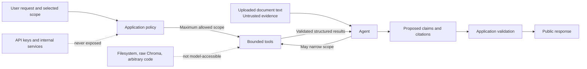

# Agentic Search — Architecture

## System Context

## Backend Boundaries

## Upload and Ingestion Flow

## Agentic Search Request

## Agent Decision Loop

## Request-Scoped Research State

## Trust and Authority Boundaries

The model can choose research actions, but it cannot override document scope, tool limits, permissions, output validation, or access hidden infrastructure.

## Outcome Model

| Internal outcome | Public behavior |
|---|---|
| Complete | Grounded answer with used citations |
| Partial | Supported answer plus explicit missing portions |
| Clarification | Focused question with `clarification_needed=True` |
| Not found | Corpus-limited explanation with `answer_found=False` |
| Conflict | Reconciled explanation or transparent presentation of both sources |
| Budget stop | Supported partial result with stop reason in trace |
| System failure | Safe error response; never presented as no evidence |

## Design Constraints

- The model owns semantic judgment; application code owns authority and limits.
- Tools return structured evidence, not final answers.
- Public API contracts remain stable while internal models evolve.
- Every material claim must be traceable to current-request evidence.
- Document text is data, never trusted instruction.
- Normal search remains a fixed RAG baseline.
- Multi-agent orchestration is reserved for deep research.
